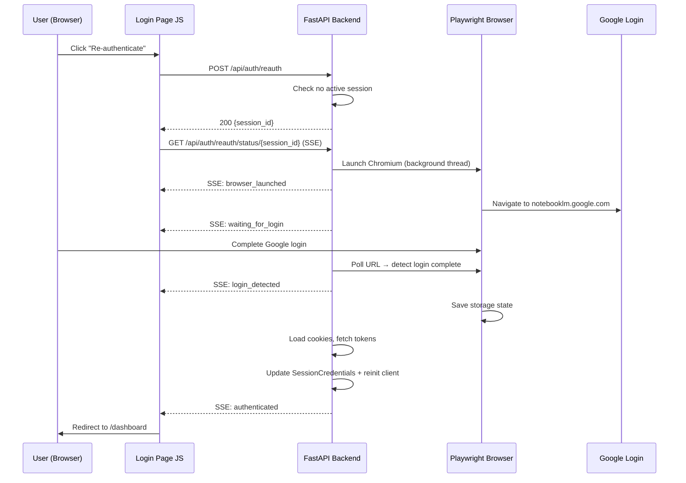

# Design Document: In-App Re-Authentication Flow

## Overview

This feature adds an in-app re-authentication flow to the NotebookLM Dashboard so users can complete Google login directly from the browser when session cookies expire, instead of running `notebooklm login` in a terminal.

The flow works as follows:
1. User clicks "Re-authenticate with Google" on the login page
2. Backend launches a non-headless Playwright Chromium browser navigated to `https://notebooklm.google.com/`
3. User logs into Google in that browser window
4. Backend detects login completion by polling the browser URL
5. Backend saves storage state, extracts cookies, fetches tokens
6. Frontend receives status updates via SSE and redirects to dashboard

The key technical challenge is replacing the CLI's `input("[Press ENTER when logged in]")` synchronization with automated URL-based detection, and running the synchronous Playwright operations in a background thread so the async FastAPI event loop is not blocked. Cross-thread communication uses stdlib `queue.Queue` (thread-safe) rather than `asyncio.Queue` (not thread-safe across threads).

## Architecture



The design uses SSE (Server-Sent Events) rather than WebSocket for the reauth status stream because:
- The communication is unidirectional (server → client only)
- SSE is simpler to implement and has built-in reconnection
- The existing WebSocket infrastructure is for grid updates and mixing concerns would complicate the `WebSocketManager`
- SSE works natively with `EventSource` in the browser — no library needed

## Components and Interfaces

### 1. `AuthManager` — New `browser_login()` Method

Added to `app/auth.py`. Runs the Playwright browser flow in a background thread and reports status via a callback.

```python
import asyncio
import threading
import queue
from enum import Enum
from dataclasses import dataclass, field
from typing import Callable, Awaitable

class ReauthPhase(str, Enum):
    """Phases of the reauth flow, emitted as SSE events."""
    BROWSER_LAUNCHED = "browser_launched"
    WAITING_FOR_LOGIN = "waiting_for_login"
    LOGIN_DETECTED = "login_detected"
    AUTHENTICATED = "authenticated"
    ERROR = "error"
    TIMEOUT = "timeout"
    CANCELLED = "cancelled"

@dataclass
class ReauthStatus:
    """Status update emitted during the reauth flow."""
    phase: ReauthPhase
    message: str = ""
    error: str | None = None

@dataclass
class ReauthSession:
    """Tracks an in-progress reauth attempt."""
    session_id: str
    active: bool = True
    _cancel: bool = False

class AuthManager:
    # ... existing methods ...

    def __init__(self) -> None:
        self._sdk_available: bool = False
        self._nlm_module: Any | None = None
        self._reauth_session: ReauthSession | None = None
        self._reauth_lock: threading.Lock = threading.Lock()
        self._reauth_thread: threading.Thread | None = None
        self._try_import_sdk()

    @property
    def reauth_active(self) -> bool:
        """Whether a reauth session is currently in progress.

        Thread-safe: acquires _reauth_lock before reading.
        """
        with self._reauth_lock:
            return self._reauth_session is not None and self._reauth_session.active

    async def browser_login(
        self,
        session_id: str,
        status_callback: Callable[[ReauthStatus], Awaitable[None]],
        timeout: int = 120,
    ) -> SessionCredentials:
        """Run the Playwright browser login in a background thread.

        Emits ReauthStatus updates via status_callback.
        Returns SessionCredentials on success.
        Raises AuthenticationError on failure.

        Thread communication uses stdlib queue.Queue (thread-safe)
        with asyncio polling on the consumer side.
        """
        ...

    def _run_playwright_login(
        self,
        status_queue: queue.Queue[ReauthStatus],
        timeout: int,
    ) -> None:
        """Synchronous Playwright login — runs in a thread.

        Launches Chromium, navigates to NotebookLM, polls URL
        for login completion, saves storage state.

        Uses stdlib queue.Queue (not asyncio.Queue) for thread-safe
        cross-thread communication with the async event loop.
        """
        ...

    def cancel_reauth(self) -> None:
        """Signal the active reauth session to cancel.

        Thread-safe: acquires _reauth_lock before writing.
        """
        ...

    async def cleanup_reauth(self) -> None:
        """Cancel any active reauth and wait for the background thread.

        Called during lifespan shutdown to prevent orphaned Chromium processes.
        """
        ...
```

### 2. Reauth Routes — `app/routes/reauth.py`

New router with two endpoints:

```python
from fastapi import APIRouter
from sse_starlette.sse import EventSourceResponse

router = APIRouter(prefix="/api/auth", tags=["auth"])

@router.post("/reauth")
async def start_reauth(auth: AuthManager, nlm_client: NotebookLMClientWrapper):
    """Launch the Playwright browser login flow.

    Returns {session_id} on success, 409 if already active,
    503 if Playwright unavailable.
    """
    ...

@router.get("/reauth/status/{session_id}")
async def reauth_status(session_id: str, auth: AuthManager):
    """SSE stream of reauth status updates.

    Emits events: browser_launched, waiting_for_login,
    login_detected, authenticated, error, timeout, cancelled.
    """
    ...
```

### 3. Login Page Updates — `app/templates/login.html`

The existing "Sign in with Google" button remains the primary action (loads credentials from existing browser storage). Below it, add a secondary "Re-authenticate with Google" button styled as a link/outline action, with explanatory text: "Session expired? Open a browser to log in again." This visual hierarchy makes the distinction clear.

The status area uses `aria-live="polite"` and `role="status"` so screen readers announce phase changes. The "Re-authenticate" button gets `aria-describedby` pointing to the status area.

```javascript
// Pseudocode for the reauth flow
async function startReauth() {
    const resp = await fetch('/api/auth/reauth', { method: 'POST' });
    const { session_id } = await resp.json();

    const source = new EventSource(`/api/auth/reauth/status/${session_id}`);
    source.addEventListener('message', (event) => {
        const status = JSON.parse(event.data);
        updateStatusUI(status.phase, status.message);
        if (status.phase === 'authenticated') {
            source.close();
            window.location.href = '/dashboard';
        }
        if (['error', 'timeout', 'cancelled'].includes(status.phase)) {
            source.close();
            showError(status.message);
        }
    });
}
```

The status indicator shows human-readable phase text and, during the `waiting_for_login` phase, displays the remaining time (e.g., "Waiting for login... (98s remaining)") so users know the timeout window.

### 4. Dependency Updates — `app/dependencies.py`

No new dependencies needed. The `get_auth_manager` dependency already provides access to `AuthManager` which will contain the new `browser_login()` method.

### 5. SSE Library — `sse-starlette`

The project needs `sse-starlette` added to `requirements.txt` for SSE support, pinned to an exact version (e.g., `sse-starlette==2.1.3`) consistent with the project's pinning strategy. This is a lightweight library that integrates with FastAPI's `StreamingResponse` pattern.

### 6. Lifespan Cleanup — `app/main.py`

The app lifespan shutdown hook must call `auth_manager.cleanup_reauth()` to cancel any active reauth session and wait for the background Playwright thread to join. This prevents orphaned Chromium processes when the server is killed (SIGTERM/SIGINT).

```python
# In the lifespan shutdown:
await auth_manager.cleanup_reauth()  # Cancel reauth, close Playwright, join thread
```

### 7. Behavior During Active Processing

If cookies expire while batch generation is running, generation tasks will fail individually with SDK authentication errors. These failures are handled by the existing `task_queue.py` error path (cells marked as `failed` with an error message). After the user re-authenticates via the reauth flow, they can retry failed cells from the processing page. The reauth flow does NOT interrupt or pause active generation — it only updates credentials for future API calls.

## Data Models

### ReauthPhase (Enum)

| Value | Description |
|-------|-------------|
| `browser_launched` | Playwright browser has been opened |
| `waiting_for_login` | Browser is at Google login, waiting for user |
| `login_detected` | URL indicates login is complete |
| `authenticated` | Cookies extracted, tokens fetched, session updated |
| `error` | An error occurred (see message) |
| `timeout` | User did not complete login within timeout |
| `cancelled` | Browser was closed by user before login completed |

### ReauthStatus (Dataclass)

| Field | Type | Description |
|-------|------|-------------|
| `phase` | `ReauthPhase` | Current phase of the reauth flow |
| `message` | `str` | Human-readable status message |
| `error` | `str \| None` | Error detail (only for error/timeout/cancelled phases) |

### ReauthSession (Dataclass)

| Field | Type | Description |
|-------|------|-------------|
| `session_id` | `str` | Unique identifier for this reauth attempt |
| `active` | `bool` | Whether the session is still in progress |
| `_cancel` | `bool` | Internal flag to signal cancellation to the background thread |

### SSE Event Format

```json
{
    "event": "reauth_status",
    "data": {
        "phase": "waiting_for_login",
        "message": "Waiting for you to complete Google login in the browser...",
        "error": null
    }
}
```

### URL Detection Logic

The Playwright URL polling uses these patterns to detect login state:

| URL Pattern | Interpretation |
|-------------|---------------|
| Contains `accounts.google.com` | Still on Google sign-in pages |
| Contains `notebooklm.google.com` without `/login` or `/signin` | Login complete |
| Page has navigated to NotebookLM app content | Login complete |

The polling interval is 1 second, with the configurable timeout (default 120s) as the upper bound.


## Correctness Properties

*A property is a characteristic or behavior that should hold true across all valid executions of a system — essentially, a formal statement about what the system should do. Properties serve as the bridge between human-readable specifications and machine-verifiable correctness guarantees.*

### Property 1: Concurrent reauth rejection

*For any* state where a `ReauthSession` is active, a new `POST /api/auth/reauth` request SHALL be rejected with a 409 status code and the existing session SHALL remain unaffected.

**Validates: Requirements 1.2**

### Property 2: SSE event ordering

*For any* sequence of `ReauthStatus` updates pushed to the status queue during a reauth flow, the SSE stream SHALL emit those events in the same order they were enqueued, with no dropped or reordered events.

**Validates: Requirements 3.1**

### Property 3: Credential update after reauth

*For any* successful reauth flow that produces valid cookies and tokens, the shared `SessionCredentials` instance SHALL contain the new cookies, CSRF token, and session ID after the flow completes.

**Validates: Requirements 4.1**

### Property 4: Session cleanup on termination

*For any* reauth flow termination — whether by success, error, timeout, or cancellation — the `ReauthSession` SHALL be marked inactive and `reauth_active` SHALL return `False` after the flow ends.

**Validates: Requirements 5.3, 7.3**

### Property 5: User-friendly error messages

*For any* error produced by the reauth flow (Playwright unavailable, browser launch failure, timeout, cancellation, token fetch failure), the error message emitted through the SSE stream SHALL not contain Python traceback text, raw exception class names, or internal module paths.

**Validates: Requirements 6.5**

### Property 6: URL detection determinism

*For any* URL string, the login detection function SHALL return a deterministic boolean result. Specifically: *for any* URL containing `accounts.google.com` or a Google sign-in path, the function SHALL classify it as "still logging in"; *for any* URL matching `notebooklm.google.com` without `/login` or `/signin` segments, the function SHALL classify it as "login complete".

**Validates: Requirements 2.1, 2.2**

## Error Handling

### Error Categories and Responses

| Error Condition | HTTP Status | SSE Phase | User Message | Recovery |
|----------------|-------------|-----------|--------------|----------|
| Playwright not installed | 503 | N/A (pre-SSE) | "Browser automation is not available. Run `playwright install chromium` to enable re-authentication." | User installs Playwright |
| Chromium not available | 503 | N/A (pre-SSE) | "Chromium browser is not installed. Run `playwright install chromium`." | User installs Chromium |
| Reauth already active | 409 | N/A (pre-SSE) | "A re-authentication session is already in progress." | Wait for current session |
| Browser launch failure | N/A | `error` | "Failed to open the login browser. Please try again." | Retry |
| Login timeout | N/A | `timeout` | "Login timed out after {N} seconds. Please try again." | Retry |
| Browser closed by user | N/A | `cancelled` | "The login browser was closed before authentication completed." | Retry |
| Cookie extraction failure | N/A | `error` | "Failed to read login cookies. Please try again." | Retry |
| Token fetch failure | N/A | `error` | "Failed to complete authentication. Please try again." | Retry |
| SDK not available | 503 | N/A (pre-SSE) | "NotebookLM SDK is not installed." | Install SDK |

### Cleanup Guarantees

On any error path:
1. The Playwright browser context is closed (if it was opened)
2. The `ReauthSession` is marked inactive (under `_reauth_lock`)
3. The `_reauth_session` reference on `AuthManager` is cleared
4. Any background thread completes (no orphaned threads)
5. On server shutdown (lifespan), `cleanup_reauth()` cancels active sessions and joins the thread

### Error Message Sanitization

All error messages passed to the frontend go through a sanitization step that:
- Strips Python traceback patterns (`Traceback (most recent call last):`, `File "..."`)
- Removes internal module paths
- Replaces raw exception class names with user-friendly descriptions
- Preserves actionable information (e.g., "run `playwright install chromium`")

## Testing Strategy

### Property-Based Testing

The project uses **Hypothesis** for property-based testing. Each correctness property maps to a single Hypothesis test with a minimum of 100 examples.

| Property | Test Approach | Generator Strategy |
|----------|--------------|-------------------|
| P1: Concurrent reauth rejection | Generate random `ReauthSession` states (active/inactive), attempt concurrent starts | `st.booleans()` for active state, `st.uuids()` for session IDs |
| P2: SSE event ordering | Generate random sequences of `ReauthStatus` objects, verify SSE output order | `st.lists(st.sampled_from(ReauthPhase))` for phase sequences |
| P3: Credential update | Generate random cookie dicts and token strings, run mock reauth, verify credentials | `st.dictionaries(st.text(), st.text())` for cookies, `st.text()` for tokens |
| P4: Session cleanup | Generate random termination reasons (success/error/timeout/cancel), verify cleanup | `st.sampled_from([success, error, timeout, cancel])` |
| P5: User-friendly errors | Generate various error conditions, verify message format | `st.sampled_from(error_conditions)` with `st.text()` for exception messages |
| P6: URL detection | Generate URLs from Google login and NotebookLM domains, verify classification | `st.sampled_from(google_login_paths)` + `st.sampled_from(notebooklm_paths)` with `st.text()` for path segments |

Each test is tagged with:
```python
# Feature: in-app-reauth-flow, Property N: <property_text>
```

### Unit Testing

Unit tests complement property tests by covering specific examples and edge cases:

- Endpoint returns 409 when reauth is active (specific example of P1)
- Endpoint returns 503 when Playwright is not installed
- SSE stream closes after `authenticated` event
- SSE stream closes after `error` event
- `cancel_reauth()` sets the cancel flag
- `browser_login()` raises `AuthenticationError` when SDK unavailable
- URL detection correctly classifies known Google login URLs
- URL detection correctly classifies NotebookLM app URLs
- Timeout value is respected (mock time)
- Credentials are cleared on failed reauth (no partial state)
- Lifespan shutdown calls `cleanup_reauth()` and joins the thread
- Thread-safe access to `_reauth_session` under concurrent reads

### Playwright Mock Strategy

Tests mock Playwright at the `_run_playwright_login` boundary — never import or run real Playwright in tests. The mock replaces the synchronous thread function and pushes predetermined `ReauthStatus` objects into the status queue. This keeps tests fast, deterministic, and free of browser dependencies.

For SSE endpoint tests, `TestClient` (httpx) supports streaming responses. Tests consume the SSE stream by iterating over `response.iter_lines()` and parsing the `data:` fields.

### Test File Organization

```
tests/
├── unit/
│   ├── test_auth_reauth.py          — Unit tests for AuthManager.browser_login()
│   ├── test_routes_reauth.py        — Unit tests for reauth endpoints + SSE
│   └── test_reauth_url_detection.py — Unit tests for URL pattern matching
└── property/
    └── test_prop_reauth.py          — Property tests for P1–P6
```
