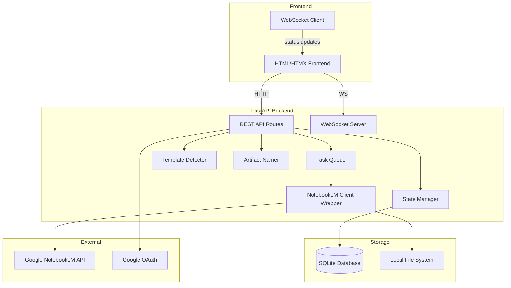
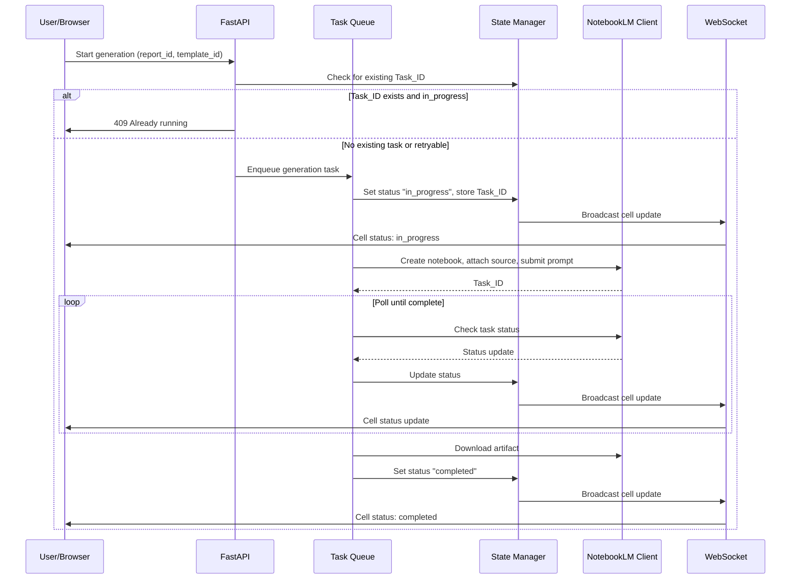

# Design Document: NotebookLM Dashboard

## Overview

The NotebookLM Dashboard is a Python-based web application using FastAPI for the backend and a responsive HTML/JS frontend. The backend orchestrates artifact generation through the `notebooklm-py` SDK, manages state persistence via SQLite, and exposes a REST + WebSocket API. The frontend renders a status grid, file browser, artifact browser, and batch controls. The architecture is designed for future Android porting via WebView by keeping the frontend as a thin client communicating over HTTP/WS.

### Key Design Decisions

1. **FastAPI + Jinja2/HTMX frontend**: Keeps the stack Python-only for simplicity, with HTMX providing reactive updates without a heavy JS framework. This simplifies Android WebView porting since the frontend is standard HTML.
2. **SQLite for state persistence**: Lightweight, file-based, no external database dependency. Sufficient for single-user local operation.
3. **notebooklm-py SDK**: Avoids complex Google Cloud setup. The SDK handles authentication via browser-based Google login and cookie management.
4. **WebSocket for real-time updates**: The Status_Grid receives live cell updates via WebSocket, avoiding polling from the frontend.
5. **Background task queue**: A simple asyncio-based task queue manages artifact generation concurrency, preventing API rate limiting and enabling pause/resume semantics.

## Architecture



### Request Flow



## Components and Interfaces

### 1. Authentication Module (`auth.py`)

Handles Google account login using the notebooklm-py SDK's built-in browser-based authentication.

```python
class AuthManager:
    async def login() -> SessionCredentials:
        """Initiates Google login via notebooklm-py, returns session credentials."""
        ...

    async def validate_session(credentials: SessionCredentials) -> bool:
        """Checks if stored credentials are still valid."""
        ...

    async def logout(credentials: SessionCredentials) -> None:
        """Clears stored credentials."""
        ...
```

### 2. Template Detector (`template_detector.py`)

Parses template filenames and classifies them by artifact type and audio format.

```python
@dataclass
class TemplateInfo:
    filename: str
    number: int
    artifact_type: str          # "infographic" | "audio" | "video"
    name: str                   # Extracted display name
    audio_format: str | None    # "DEEP_DIVE" | "BRIEF" | "CRITIQUE" | "DEBATE" | None
    content: str                # Raw markdown content
    is_excluded: bool           # True for steering prompts

class TemplateDetector:
    FILENAME_PATTERN = r"^(\d+)_([^_]+)_(.+)\.md$"
    EXCLUDED_FILES = {"01_Steering Prompt.md"}

    TYPE_MAP = {
        "Infographic": "infographic",
        "Audio": "audio",
        "Video": "video",
    }

    AUDIO_FORMAT_MAP = {
        "DeepDive": "DEEP_DIVE",
        "TheBrief": "BRIEF",
        "Critique": "CRITIQUE",
        "Debate": "DEBATE",
    }

    def parse_filename(self, filename: str) -> TemplateInfo | None:
        """Parse a template filename into TemplateInfo. Returns None if unparseable."""
        ...

    def detect_type_from_content(self, content: str) -> str | None:
        """Fallback: detect artifact type from template file content."""
        ...

    def load_templates(self, directory: str) -> list[TemplateInfo]:
        """Load and classify all templates from a directory."""
        ...
```

### 3. Artifact Namer (`artifact_namer.py`)

Derives artifact and notebook names from filenames.

```python
class ArtifactNamer:
    EXTENSION_MAP = {
        "infographic": ".png",
        "audio": ".mp3",
        "video": ".mp4",
    }

    def derive_artifact_name(self, template_filename: str) -> str:
        """Extract the Name portion from {number}_{Type}_{Name}.md"""
        ...

    def derive_notebook_name(self, report_filename: str) -> str:
        """Strip extension from report filename."""
        ...

    def get_artifact_filename(self, template_filename: str, artifact_type: str) -> str:
        """Combine derived name with correct extension."""
        ...
```

### 4. State Manager (`state_manager.py`)

Manages persistence of all application state to SQLite and broadcasts changes via WebSocket.

```python
class CellStatus(str, Enum):
    NOT_STARTED = "not_started"
    PENDING = "pending"
    IN_PROGRESS = "in_progress"
    COMPLETED = "completed"
    FAILED = "failed"
    STOPPED = "stopped"

@dataclass
class GenerationCell:
    report_id: str
    template_id: str
    status: CellStatus
    task_id: str | None
    notebook_id: str | None
    error_message: str | None
    started_at: datetime | None
    completed_at: datetime | None
    artifact_path: str | None

class StateManager:
    def __init__(self, db_path: str, ws_manager: WebSocketManager):
        ...

    async def get_cell(self, report_id: str, template_id: str) -> GenerationCell:
        ...

    async def update_cell(self, cell: GenerationCell) -> None:
        """Update cell in DB and broadcast via WebSocket."""
        ...

    async def get_all_cells(self) -> list[GenerationCell]:
        ...

    async def get_cells_by_status(self, status: CellStatus) -> list[GenerationCell]:
        ...

    async def persist_reports(self, reports: list[Report]) -> None:
        ...

    async def persist_templates(self, templates: list[TemplateInfo]) -> None:
        ...

    async def load_state(self) -> dict:
        """Load full state from DB on startup."""
        ...
```

### 5. Task Queue (`task_queue.py`)

Manages artifact generation concurrency with pause/resume/stop semantics.

```python
class TaskQueue:
    def __init__(self, state_manager: StateManager, nlm_client: NotebookLMClientWrapper, max_concurrent: int = 2):
        ...

    async def enqueue(self, report_id: str, template_id: str) -> str:
        """Add a generation task. Returns Task_ID. Raises if duplicate in_progress."""
        ...

    async def start_all(self, cells: list[GenerationCell]) -> None:
        """Enqueue all not_started/pending cells."""
        ...

    async def pause(self) -> None:
        """Stop dequeuing new tasks. In-progress tasks continue."""
        ...

    async def resume(self) -> None:
        """Resume dequeuing tasks."""
        ...

    async def stop_all(self) -> None:
        """Cancel all in-progress tasks."""
        ...

    async def retry_failed(self) -> None:
        """Re-enqueue all failed cells with new Task_IDs."""
        ...

    async def stop_task(self, report_id: str, template_id: str) -> None:
        """Cancel a specific in-progress task."""
        ...
```

### 6. NotebookLM Client Wrapper (`nlm_client.py`)

Wraps the notebooklm-py SDK to provide a clean async interface.

```python
class NotebookLMClientWrapper:
    def __init__(self, credentials: SessionCredentials):
        ...

    async def create_notebook(self, name: str, source_path: str) -> str:
        """Create notebook, attach source. Returns notebook_id."""
        ...

    async def submit_generation(self, notebook_id: str, prompt: str, artifact_type: str, audio_format: str | None = None) -> str:
        """Submit artifact generation. Returns task_id."""
        ...

    async def poll_status(self, task_id: str) -> dict:
        """Check generation status. Returns {status, progress, error}."""
        ...

    async def download_artifact(self, task_id: str, output_path: str) -> str:
        """Download completed artifact to output_path. Returns file path."""
        ...

    async def list_notebooks(self) -> list[dict]:
        """List all notebooks in the account for crash recovery."""
        ...
```

### 7. WebSocket Manager (`ws_manager.py`)

Manages WebSocket connections for real-time Status_Grid updates.

```python
class WebSocketManager:
    def __init__(self):
        self.active_connections: list[WebSocket] = []

    async def connect(self, websocket: WebSocket) -> None:
        ...

    async def disconnect(self, websocket: WebSocket) -> None:
        ...

    async def broadcast_cell_update(self, cell: GenerationCell) -> None:
        """Send cell status update to all connected clients."""
        ...

    async def broadcast_batch_update(self, cells: list[GenerationCell]) -> None:
        ...
```

### 8. REST API Routes (`routes.py`)

```python
# Authentication
POST   /api/auth/login          # Initiate Google login
POST   /api/auth/logout         # Clear session
GET    /api/auth/status         # Check auth status

# Reports
GET    /api/reports             # List active reports
POST   /api/reports             # Add reports (file upload)
DELETE /api/reports/{id}        # Remove a report
PATCH  /api/reports/{id}        # Update notebook name

# Templates
GET    /api/templates           # List loaded templates
POST   /api/templates           # Add custom template
PATCH  /api/templates/{id}      # Edit template prompt

# Generation
POST   /api/generate/{report_id}/{template_id}   # Start single generation
DELETE /api/generate/{report_id}/{template_id}    # Stop single generation
POST   /api/generate/{report_id}/{template_id}/retry  # Retry single

# Batch
POST   /api/batch/start         # Start all
POST   /api/batch/pause         # Pause
POST   /api/batch/resume        # Resume
POST   /api/batch/stop          # Stop all
POST   /api/batch/retry-failed  # Retry all failed

# Status Grid
GET    /api/grid                # Get full grid state
WS     /ws/grid                 # WebSocket for live updates

# Artifacts
GET    /api/artifacts           # List artifacts with filters
GET    /api/artifacts/{id}      # Get/download specific artifact
GET    /api/artifacts/{id}/preview  # Inline preview

# Recovery
POST   /api/recovery/sync      # Trigger crash recovery sync
```


## Data Models

### SQLite Schema

```sql
CREATE TABLE reports (
    id TEXT PRIMARY KEY,
    filename TEXT NOT NULL,
    filepath TEXT NOT NULL,
    file_size INTEGER,
    last_modified TEXT,
    notebook_name TEXT NOT NULL,
    notebook_name_edited BOOLEAN DEFAULT FALSE,
    created_at TEXT DEFAULT CURRENT_TIMESTAMP
);

CREATE TABLE templates (
    id TEXT PRIMARY KEY,
    filename TEXT NOT NULL,
    number INTEGER NOT NULL,
    artifact_type TEXT NOT NULL CHECK(artifact_type IN ('infographic', 'audio', 'video')),
    name TEXT NOT NULL,
    audio_format TEXT CHECK(audio_format IN ('DEEP_DIVE', 'BRIEF', 'CRITIQUE', 'DEBATE', NULL)),
    content TEXT NOT NULL,
    content_edited BOOLEAN DEFAULT FALSE,
    is_excluded BOOLEAN DEFAULT FALSE,
    created_at TEXT DEFAULT CURRENT_TIMESTAMP
);

CREATE TABLE generation_cells (
    report_id TEXT NOT NULL REFERENCES reports(id),
    template_id TEXT NOT NULL REFERENCES templates(id),
    status TEXT NOT NULL DEFAULT 'not_started'
        CHECK(status IN ('not_started', 'pending', 'in_progress', 'completed', 'failed', 'stopped')),
    task_id TEXT,
    notebook_id TEXT,
    error_message TEXT,
    started_at TEXT,
    completed_at TEXT,
    artifact_path TEXT,
    PRIMARY KEY (report_id, template_id)
);

CREATE TABLE artifacts (
    id TEXT PRIMARY KEY,
    report_id TEXT NOT NULL REFERENCES reports(id),
    template_id TEXT NOT NULL REFERENCES templates(id),
    artifact_type TEXT NOT NULL,
    artifact_name TEXT NOT NULL,
    file_path TEXT NOT NULL,
    file_extension TEXT NOT NULL,
    source_location TEXT,
    source_filename TEXT,
    created_at TEXT DEFAULT CURRENT_TIMESTAMP
);

CREATE INDEX idx_cells_status ON generation_cells(status);
CREATE INDEX idx_cells_task_id ON generation_cells(task_id);
CREATE INDEX idx_artifacts_type ON artifacts(artifact_type);
CREATE INDEX idx_artifacts_source ON artifacts(source_filename);
```

### Pydantic Models

```python
from pydantic import BaseModel
from datetime import datetime
from enum import Enum

class ArtifactType(str, Enum):
    INFOGRAPHIC = "infographic"
    AUDIO = "audio"
    VIDEO = "video"

class AudioFormat(str, Enum):
    DEEP_DIVE = "DEEP_DIVE"
    BRIEF = "BRIEF"
    CRITIQUE = "CRITIQUE"
    DEBATE = "DEBATE"

class CellStatus(str, Enum):
    NOT_STARTED = "not_started"
    PENDING = "pending"
    IN_PROGRESS = "in_progress"
    COMPLETED = "completed"
    FAILED = "failed"
    STOPPED = "stopped"

class ReportModel(BaseModel):
    id: str
    filename: str
    filepath: str
    file_size: int | None
    last_modified: str | None
    notebook_name: str
    notebook_name_edited: bool = False

class TemplateModel(BaseModel):
    id: str
    filename: str
    number: int
    artifact_type: ArtifactType
    name: str
    audio_format: AudioFormat | None = None
    content: str
    content_edited: bool = False
    is_excluded: bool = False

class GenerationCellModel(BaseModel):
    report_id: str
    template_id: str
    status: CellStatus
    task_id: str | None = None
    notebook_id: str | None = None
    error_message: str | None = None
    started_at: datetime | None = None
    completed_at: datetime | None = None
    artifact_path: str | None = None

class ArtifactModel(BaseModel):
    id: str
    report_id: str
    template_id: str
    artifact_type: ArtifactType
    artifact_name: str
    file_path: str
    file_extension: str
    source_location: str | None = None
    source_filename: str | None = None
    created_at: datetime

class GridStateModel(BaseModel):
    reports: list[ReportModel]
    templates: list[TemplateModel]
    cells: list[GenerationCellModel]

class ArtifactFilterModel(BaseModel):
    source_location: str | None = None
    source_filename: str | None = None
    artifact_type: ArtifactType | None = None
```

### File System Layout

```
project_root/
├── app/
│   ├── __init__.py
│   ├── main.py              # FastAPI app entry point
│   ├── auth.py              # AuthManager
│   ├── template_detector.py # TemplateDetector
│   ├── artifact_namer.py    # ArtifactNamer
│   ├── state_manager.py     # StateManager
│   ├── task_queue.py        # TaskQueue
│   ├── nlm_client.py        # NotebookLMClientWrapper
│   ├── ws_manager.py        # WebSocketManager
│   ├── routes.py            # API routes
│   ├── models.py            # Pydantic models
│   └── templates/           # Jinja2 HTML templates
│       ├── base.html
│       ├── login.html
│       ├── dashboard.html
│       ├── grid.html
│       ├── artifacts.html
│       └── file_browser.html
├── static/
│   ├── css/
│   │   └── styles.css
│   └── js/
│       ├── grid.js          # WebSocket + grid rendering
│       └── app.js           # General UI logic
├── data/
│   └── dashboard.db         # SQLite database
├── output/
│   ├── infographics/        # Generated PNGs
│   ├── audio/               # Generated MP3s
│   └── video/               # Generated MP4s
├── tests/
│   ├── test_template_detector.py
│   ├── test_artifact_namer.py
│   ├── test_state_manager.py
│   ├── test_task_queue.py
│   └── test_filters.py
├── requirements.txt
└── README.md
```


## Correctness Properties

*A property is a characteristic or behavior that should hold true across all valid executions of a system — essentially, a formal statement about what the system should do. Properties serve as the bridge between human-readable specifications and machine-verifiable correctness guarantees.*

### Property 1: Notebook name derivation

*For any* report filename (with any valid extension), deriving the notebook name should produce the filename without its extension, and this operation should be consistent (applying it twice to the same input yields the same result).

**Validates: Requirements 3.1, 3.3**

### Property 2: Template type classification from filename

*For any* template filename containing one of the type keywords ("Infographic", "Audio", "Video"), the Template_Detector should classify it as the corresponding artifact type ("infographic", "audio", "video") according to the TYPE_MAP.

**Validates: Requirements 4.2, 4.3, 4.4**

### Property 3: Audio format detection from filename

*For any* audio template filename containing one of the audio format keywords ("DeepDive", "TheBrief", "Critique", "Debate"), the Template_Detector should set the audio_format to the corresponding value ("DEEP_DIVE", "BRIEF", "CRITIQUE", "DEBATE") according to the AUDIO_FORMAT_MAP.

**Validates: Requirements 4.5, 4.6, 4.7, 4.8**

### Property 4: Template filename parsing round trip

*For any* valid TemplateInfo object (with number, type, and name), formatting it into the filename pattern `{number}_{Type}_{Name}.md` and then parsing it back should produce an equivalent TemplateInfo (same number, artifact_type, and name).

**Validates: Requirements 4.1**

### Property 5: Artifact filename derivation

*For any* valid template filename matching the pattern `{number}_{Type}_{Name}.md` and any artifact type, the Artifact_Namer should produce a filename equal to `{Name}` + the correct extension (".png" for infographic, ".mp3" for audio, ".mp4" for video).

**Validates: Requirements 5.1, 5.3**

### Property 6: File format validation

*For any* filename whose extension is not ".pdf" or ".md", the file selection validator should reject the file. Conversely, for any filename with extension ".pdf" or ".md", the validator should accept the file.

**Validates: Requirements 2.5**

### Property 7: Report selection grows active list

*For any* active report list and any set of new report files (not already in the list), adding them should increase the list length by exactly the number of new files added, and all new files should appear in the resulting list.

**Validates: Requirements 2.3**

### Property 8: Report removal shrinks active list and grid

*For any* active report list containing at least one report, removing a report should decrease the list length by one, and the removed report should no longer appear in the list or in any Status_Grid row.

**Validates: Requirements 2.4**

### Property 9: Duplicate prevention

*For any* generation cell that already has a Task_ID with status "in_progress", attempting to start generation should not create a new Task_ID and should return an error/conflict response.

**Validates: Requirements 6.4, 8.4**

### Property 10: Cell status invariant

*For any* GenerationCell in the system, the status field should always be one of the valid CellStatus enum values: "not_started", "pending", "in_progress", "completed", "failed", or "stopped".

**Validates: Requirements 7.3**

### Property 11: Grid dimensions

*For any* set of N reports and M templates, the Status_Grid should contain exactly N × M cells, with one cell for each unique (report_id, template_id) pair.

**Validates: Requirements 7.1**

### Property 12: Start transitions cell status correctly

*For any* generation cell with status "not_started" or "pending", starting generation should transition the cell to "in_progress" status and assign a Task_ID.

**Validates: Requirements 8.1**

### Property 13: Stop transitions cell status correctly

*For any* generation cell with status "in_progress", stopping generation should transition the cell to "stopped" status.

**Validates: Requirements 8.2**

### Property 14: Retry transitions cell status with new Task_ID

*For any* generation cell with status "failed" or "stopped", retrying should transition the cell to "in_progress" status and assign a new Task_ID different from the previous one.

**Validates: Requirements 8.3**

### Property 15: Start All transitions all eligible cells

*For any* grid state, executing "Start All" should transition every cell with status "not_started" or "pending" to "in_progress", and should not modify cells with any other status.

**Validates: Requirements 9.1**

### Property 16: Pause/Resume round trip

*For any* task queue state, pausing and then immediately resuming should restore the queue to a state where new tasks can be dequeued, and no tasks should be lost during the pause/resume cycle.

**Validates: Requirements 9.2, 9.3**

### Property 17: Stop All transitions all in-progress cells

*For any* grid state, executing "Stop All" should transition every cell with status "in_progress" to "stopped", and should not modify cells with any other status.

**Validates: Requirements 9.4**

### Property 18: Retry Failed transitions all failed cells

*For any* grid state, executing "Retry Failed" should transition every cell with status "failed" to "in_progress" with new Task_IDs, and should not modify cells with any other status.

**Validates: Requirements 9.5**

### Property 19: State persistence round trip

*For any* valid application state (reports, templates, cells with statuses and Task_IDs), persisting to the database and then loading should produce an equivalent state.

**Validates: Requirements 10.4**

### Property 20: Recovery matching

*For any* set of remote notebooks (with IDs) and local generation cells (with notebook_ids), the recovery matching algorithm should correctly pair each remote notebook to its local cell when the notebook_id matches, and should not create false matches.

**Validates: Requirements 10.2**

### Property 21: Untracked notebook detection

*For any* set of remote notebooks and local state, notebooks whose IDs do not appear in any local generation cell should be classified as "untracked".

**Validates: Requirements 10.5**

### Property 22: Artifact filtering

*For any* set of artifacts and any combination of filters (source_location, source_filename, artifact_type), the filtered result should contain only artifacts that match all active filter criteria, and should contain every artifact that matches all active filter criteria (no false exclusions).

**Validates: Requirements 11.2, 11.3, 11.4, 11.5**

## Error Handling

### Authentication Errors
- **Invalid credentials**: Display error message, allow retry (Req 1.3)
- **Session expiry**: Detect on API call failure, redirect to login
- **Network failure during auth**: Display connectivity error with retry option

### File System Errors
- **Prompts directory not found**: Display configuration error, allow user to set directory path
- **Template file unreadable**: Skip file, log warning, continue loading other templates
- **Output directory not writable**: Display error before generation starts

### NotebookLM API Errors
- **Rate limiting**: Exponential backoff with max 5 retries, then mark cell as failed
- **API timeout**: Retry up to 3 times, then mark cell as failed with timeout message
- **Invalid response**: Log response, mark cell as failed with parse error
- **Notebook creation failure**: Mark cell as failed, do not retry automatically

### State Management Errors
- **Database corruption**: Attempt recovery from last known good state, fall back to fresh state
- **WebSocket disconnection**: Auto-reconnect with exponential backoff, queue missed updates
- **Concurrent state modification**: Use SQLite transactions with WAL mode for safe concurrent access

### Task Queue Errors
- **Task cancellation failure**: Mark as stopped regardless, log the cancellation error
- **Queue overflow**: Reject new tasks with capacity error, suggest reducing batch size

## Testing Strategy

### Testing Framework

- **Unit tests**: `pytest` with `pytest-asyncio` for async code
- **Property-based tests**: `hypothesis` library (>= 6.0)
- **Mocking**: `unittest.mock` and `pytest-mock` for NotebookLM API calls

### Unit Tests

Unit tests focus on specific examples, edge cases, and integration points:

- Template detection with the 13 known active templates (specific examples)
- Artifact naming with the specific example from requirements (5.2)
- Steering prompt exclusion (4.9)
- Content-based type fallback detection (4.10)
- Authentication flow happy path and error cases
- WebSocket message format validation
- API route response codes and payloads

### Property-Based Tests

Each correctness property maps to a property-based test using Hypothesis. Configuration:

- Minimum 100 iterations per property test
- Each test tagged with: **Feature: notebooklm-dashboard, Property {N}: {title}**
- Custom Hypothesis strategies for generating:
  - Valid template filenames matching `{number}_{Type}_{Name}.md`
  - Valid report filenames with `.pdf` or `.md` extensions
  - Random `GenerationCell` objects with valid status transitions
  - Random `ArtifactModel` objects with various filter combinations
  - Random grid states with N reports × M templates

### Test Organization

```
tests/
├── unit/
│   ├── test_template_detector.py      # Known template examples, edge cases
│   ├── test_artifact_namer.py         # Specific naming examples
│   ├── test_state_manager.py          # DB operations, error cases
│   ├── test_task_queue.py             # Queue behavior, error cases
│   └── test_routes.py                 # API endpoint tests
├── property/
│   ├── test_prop_template_detector.py # Properties 2, 3, 4
│   ├── test_prop_artifact_namer.py    # Properties 1, 5
│   ├── test_prop_file_validation.py   # Property 6
│   ├── test_prop_report_list.py       # Properties 7, 8
│   ├── test_prop_cell_status.py       # Properties 9, 10, 11, 12, 13, 14
│   ├── test_prop_batch.py             # Properties 15, 16, 17, 18
│   ├── test_prop_state.py             # Properties 19, 20, 21
│   └── test_prop_filters.py          # Property 22
└── conftest.py                        # Shared fixtures and strategies
```
