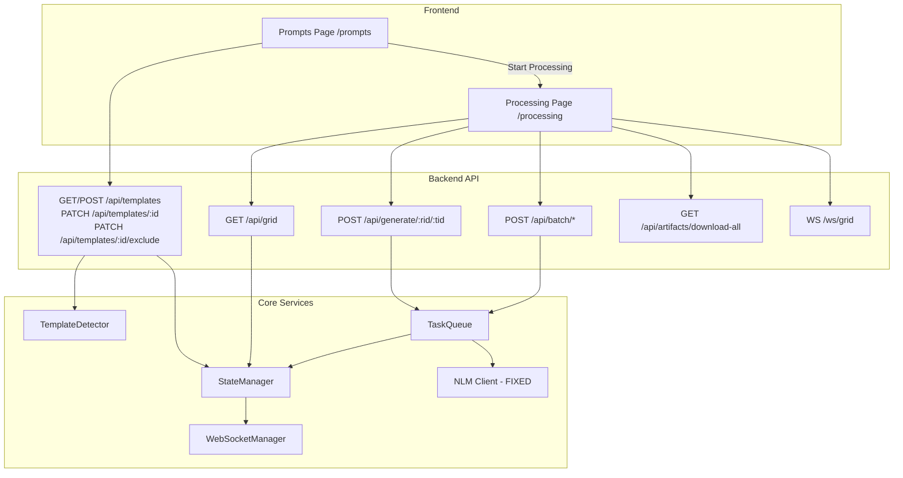

# Design Document: Prompt Management and Processing View

## Overview

This feature adds two new pages (/prompts and /processing), fixes the NLM client SDK API mismatch, and adds deduplication, deletion sync, long-running task handling, and offline artifact download. It extends the existing FastAPI + Jinja2 + vanilla JS architecture, reusing the current TemplateDetector, StateManager, TaskQueue, and WebSocketManager components.

## Architecture



## Components and Interfaces

### 1. NLM Client SDK Fix (`app/nlm_client.py`)

The wrapper must be updated to use the SDK's sub-API pattern. The `notebooklm-py` SDK exposes functionality through sub-objects on the client:

| Wrapper Method | Current (BROKEN) | Fixed (SDK sub-API) |
|---|---|---|
| `create_notebook(name, source_path)` | `client.create_notebook(title=name)` + `client.add_source(...)` | `client.notebooks.create(title=name)` + `client.sources.add_file(notebook_id, file_path)` |
| `submit_generation(notebook_id, prompt, type, fmt)` | `client.generate(**kwargs)` | `client.artifacts.generate_infographic(...)` / `generate_audio(...)` / `generate_video(...)` based on type |
| `poll_status(task_id)` | `client.get_task_status(task_id)` | `client.artifacts.poll_status(notebook_id, task_id)` |
| `download_artifact(task_id, output_path)` | `client.download_artifact(task_id, output_path)` | `client.artifacts.download_infographic(...)` / `download_audio(...)` / `download_video(...)` based on type |
| `list_notebooks()` | `client.list_notebooks()` | `client.notebooks.list()` |
| `list_notebook_artifacts(notebook_id)` | `client.list_artifacts(notebook_id)` | `client.artifacts.list(notebook_id)` |
| `delete_artifact(notebook_id, artifact_id)` | `client.delete_artifact(...)` | `client.artifacts.delete(notebook_id, artifact_id)` |
| `delete_notebook(notebook_id)` | `client.delete_notebook(notebook_id)` | `client.notebooks.delete(notebook_id)` |

Key changes to method signatures:
- `submit_generation` needs `artifact_type` to dispatch to the correct `generate_*` method
- `poll_status` now needs `notebook_id` in addition to `task_id` — the `GenerationCell` already stores `notebook_id`
- `download_artifact` now needs `notebook_id` and `artifact_type` to dispatch to the correct `download_*` method
- All SDK methods are async — the wrapper already uses `await` correctly

SDK return types:
- `client.notebooks.create()` → `Notebook` (has `.id`, `.title`)
- `client.notebooks.list()` → `list[Notebook]`
- `client.artifacts.generate_*()` → `GenerationStatus` (has `.task_id`, `.status`, `.is_complete`, `.is_failed`, `.is_in_progress`)
- `client.artifacts.poll_status()` → `GenerationStatus`
- `client.artifacts.list()` → `list[Artifact]` (has `.id`, `.title`, `.artifact_type`, `.created_at`)
- `client.sources.add_file()` → `Source`
- `client.artifacts.download_*()` → `str` (file path)
- `client.notebooks.delete()` → `bool`
- `client.artifacts.delete()` → `bool`

### 2. Template Exclusion API (extension to `app/routes/templates.py`)

```python
# PATCH /api/templates/{template_id}/exclude
# Request: { "is_excluded": true }
# Response: { "status": "updated", "template_id": "...", "is_excluded": true }
```

Add `update_template_exclusion()` method to StateManager. The `is_excluded` field already exists on the templates table.

### 3. Prompt Browser Frontend (`static/js/prompts.js`)

New JS module for the `/prompts` page:
- Upload zone: drag-and-drop area + file picker button. On upload, POST multipart to `/api/templates`. Show progress per file.
- Template list: fetched from `GET /api/templates`, grouped by `artifact_type`. Each shows name, type, audio format badge, edited indicator, selection checkbox.
- Inline editor: clicking a template opens a `<textarea>`. Save button PATCHes `/api/templates/{id}`. Validates non-empty before submit.
- Selection: checkboxes toggle `is_excluded` via `PATCH /api/templates/{id}/exclude`. "Select All" / "Deselect All" buttons.
- "Start Processing" button navigates to `/processing`.

### 4. Processing Matrix Frontend (`static/js/processing.js`)

New JS module for the `/processing` page:
- Fetches grid state from `GET /api/grid`.
- Renders table: rows = reports, columns = templates where `is_excluded === false`.
- Each cell: color-coded status + action buttons (start/stop/retry/preview/download).
- Connects to `WS /ws/grid` for real-time updates.
- Batch controls bar: Start All, Pause, Resume, Stop All, Retry Failed.
- Progress summary bar: "12/18 complete, 3 in progress, 2 failed".
- Horizontal scroll with sticky first column.
- "Download All Completed" button triggers ZIP download.
- Offline marker: uses `localStorage` to track downloaded artifact IDs.

### 5. Artifact ZIP Download API (extension to `app/routes/artifacts.py`)

```python
# GET /api/artifacts/download-all
# Response: ZIP file stream containing all completed artifacts
```

Query StateManager for completed cells with artifact_path. Stream a ZIP using `zipfile` + `StreamingResponse`.

### 6. Deduplication Logic (extension to `app/task_queue.py`)

Before enqueuing a generation task:
1. Check if a completed cell exists for the same (report_id, template_id) with matching content hashes.
2. If found, skip generation and return the existing cell as "already completed".
3. The `batch/start` endpoint skips all completed cells.

### 7. Page Routes (extension to `app/routes/pages.py`)

```python
# GET /prompts → renders prompts.html
# GET /processing → renders processing.html
```

### 8. HTML Templates

- `app/templates/prompts.html` — Prompt browser page extending `base.html`
- `app/templates/processing.html` — Processing matrix page extending `base.html`
- Update `app/templates/base.html` — Add "Prompts" and "Processing" nav links

### 9. Steering File Enhancements

Update all steering files in `.kiro/steering/` to add checks that would have caught the missing prompt management UI:
- `ba-product-owner-review.md`: Add "End-to-End Workflow Validation" section requiring every user journey to be walkable from start to finish
- `code-review-standards.md`: Add "SDK API Verification" section requiring runtime verification of third-party SDK method signatures
- `ui-ux-standards.md`: Add "Feature Completeness" section requiring every data entity to have a management UI
- `testing-standards.md`: Add "Integration Smoke Test" section requiring end-to-end workflow tests
- `architecture-guidelines.md`: Add "Third-Party SDK Integration" section with rules for verifying SDK APIs at init time

## Data Models

### Existing Models (unchanged)
- `TemplateModel` — already has `is_excluded: bool` and `content_edited: bool`
- `GenerationCellModel` — already has `artifact_path`, `notebook_id`
- `CellStatus` enum — covers all needed statuses

### New Models

```python
class UpdateTemplateExclusionRequest(BaseModel):
    is_excluded: bool

class BatchProgressSummary(BaseModel):
    total: int
    completed: int
    in_progress: int
    failed: int
    not_started: int
    stopped: int
    pending: int
```

### localStorage Schema (Frontend)

```javascript
// Key: "offline_artifacts"
// Value: JSON array of artifact IDs that have been downloaded
// Example: ["art-001", "art-002"]
```

## Correctness Properties

### Property 1: SDK method dispatch by artifact type
*For any* valid artifact type (infographic, audio, video), the wrapper's `submit_generation` method SHALL dispatch to the correct SDK `generate_*` method, and the `download_artifact` method SHALL dispatch to the correct `download_*` method.

**Validates: Requirements 1.7, 1.9**

### Property 2: Template upload deduplication
*For any* template uploaded twice with the same filename but different content, the database SHALL contain exactly one template record with that filename, and its content SHALL match the second upload.

**Validates: Requirement 2.5**

### Property 3: Batch progress summary accuracy
*For any* set of generation cells with various statuses, the batch progress summary counts SHALL exactly match the actual count of cells in each status category, and the total SHALL equal the sum of all categories.

**Validates: Requirement 5.6**

### Property 4: Deduplication key determinism
*For any* report content and template content, computing the deduplication key twice SHALL produce the same result. Different content SHALL produce different keys (with high probability).

**Validates: Requirement 7.2**

### Property 5: Batch generation skips completed cells
*For any* grid state containing a mix of completed and non-completed cells, batch start SHALL only enqueue cells that are not completed, and the count of enqueued cells SHALL equal the count of non-completed cells.

**Validates: Requirements 7.1, 7.6**

### Property 6: Template exclusion toggle is idempotent
*For any* template, toggling `is_excluded` to `true` twice SHALL leave the template excluded, and toggling to `false` twice SHALL leave it included. The final state depends only on the last toggle value, not the history.

**Validates: Requirements 3.4**

## Testing Strategy

### Testing Framework
- Unit tests: `pytest` with `pytest-asyncio`
- Property-based tests: `hypothesis` library
- Sample test data: `tests/testdata/02_Infographic_One-page Map of a Complex Topic.md`, `tests/testdata/07_Audio_DeepDive.md`, `tests/testdata/11_Video_Teach a Beginner.md`

### Test Organization
```
tests/
├── unit/
│   ├── test_nlm_client.py          # SDK API fix tests (enhanced)
│   ├── test_template_upload.py     # Upload endpoint tests
│   └── test_processing_routes.py   # Processing page/ZIP tests
├── property/
│   ├── test_prop_nlm_dispatch.py   # Property 1: SDK dispatch
│   ├── test_prop_template_upload.py # Property 2: Upload dedup
│   ├── test_prop_batch.py          # Properties 3, 5: Progress + skip
│   ├── test_prop_dedup.py          # Property 4: Dedup key
│   └── test_prop_template_exclusion.py # Property 6: Exclusion toggle
└── testdata/
    ├── 02_Infographic_One-page Map of a Complex Topic.md
    ├── 07_Audio_DeepDive.md
    └── 11_Video_Teach a Beginner.md
```

## Error Handling

### SDK API Errors
- All SDK calls wrapped in try/except with `NotebookLMClientError`
- Rate limiting: exponential backoff with max 5 retries
- Timeout: 2-hour max for polling, then mark as failed

### Upload Errors
- Invalid filename pattern: reject with descriptive error, continue processing valid files
- Empty content: reject with validation error
- Non-`.md` file: reject with format validation error
- Zero files selected: no-op, no error

### Deletion Errors
- Remote deletion failure: delete local record, warn user about remote failure
- Network error: same graceful degradation

## Acceptance Criteria → Test Coverage Matrix

This matrix maps every acceptance criterion to its test type and test location. Criteria marked "manual" require frontend verification and cannot be automated via backend tests.

### Req 1: NLM Client SDK API Fix (10 AC)

| AC | Description | Test Type | Test Location | Notes |
|----|-------------|-----------|---------------|-------|
| 1.1 | list_notebooks uses notebooks.list() | unit | test_nlm_client.py | Mock SDK sub-API |
| 1.2 | create_notebook uses notebooks.create() | unit | test_nlm_client.py | Mock SDK sub-API |
| 1.3 | list_notebook_artifacts uses artifacts.list() | unit | test_nlm_client.py | Mock SDK sub-API |
| 1.4 | delete_artifact uses artifacts.delete() | unit | test_nlm_client.py | Mock SDK sub-API |
| 1.5 | delete_notebook uses notebooks.delete() | unit | test_nlm_client.py | Mock SDK sub-API |
| 1.6 | add_source uses sources.add_file() | unit | test_nlm_client.py | Mock SDK sub-API |
| 1.7 | generate dispatches by artifact type | property | test_prop_nlm_dispatch.py | Property 1 |
| 1.8 | poll_status uses artifacts.poll_status() | unit | test_nlm_client.py | Needs notebook_id |
| 1.9 | download dispatches by artifact type | property | test_prop_nlm_dispatch.py | Property 1 |
| 1.10 | Correct SDK return type handling | unit | test_nlm_client.py | Mock Notebook/Artifact/GenerationStatus objects |

### Req 2: Prompt Template Upload (8 AC)

| AC | Description | Test Type | Test Location | Notes |
|----|-------------|-----------|---------------|-------|
| 2.1 | Drag-and-drop zone and file picker | manual | — | Frontend UI |
| 2.2 | Parse filename and classify | unit + property | test_template_upload.py, test_prop_template_detector.py | Use sample testdata files |
| 2.3 | Reject invalid filename pattern | unit | test_template_upload.py | Test with non-matching filenames |
| 2.4 | Persist to database | unit | test_template_upload.py | Verify DB state after upload |
| 2.5 | Update existing on duplicate filename | property | test_prop_template_upload.py | Property 2 |
| 2.6 | Upload progress and messages | manual | — | Frontend UI |
| 2.7 | Zero file selection is no-op | unit | test_template_upload.py | Edge case |
| 2.8 | Reject non-.md files | unit | test_template_upload.py | Format validation |

### Req 3: Prompt Template Browsing and Selection (7 AC)

| AC | Description | Test Type | Test Location | Notes |
|----|-------------|-----------|---------------|-------|
| 3.1 | Display grouped by artifact type | manual | — | Frontend rendering |
| 3.2 | Display number, name, type, audio format | manual | — | Frontend rendering |
| 3.3 | Checkbox to include/exclude | manual | — | Frontend UI |
| 3.4 | Toggle updates via API | unit + property | test_template_upload.py, test_prop_template_exclusion.py | Property 6 |
| 3.5 | Select All / Deselect All | manual | — | Frontend UI |
| 3.6 | Visually distinguish edited templates | manual | — | Frontend rendering |
| 3.7 | Empty state when no templates | manual | — | Frontend rendering |

### Req 4: Prompt Content Editing (5 AC)

| AC | Description | Test Type | Test Location | Notes |
|----|-------------|-----------|---------------|-------|
| 4.1 | Open editor with full content | manual | — | Frontend UI |
| 4.2 | Save and mark as content_edited | unit | test_template_upload.py | Existing PATCH endpoint |
| 4.3 | Confirmation on save | manual | — | Frontend UI |
| 4.4 | Reject empty/whitespace content | unit | test_template_upload.py | Edge case |
| 4.5 | Unsaved changes warning | manual | — | Frontend beforeunload |

### Req 5: Processing Matrix View (6 AC)

| AC | Description | Test Type | Test Location | Notes |
|----|-------------|-----------|---------------|-------|
| 5.1 | Rows=reports, columns=selected templates | manual | — | Frontend rendering |
| 5.2 | Color-coded status indicators | manual | — | Frontend rendering |
| 5.3 | Detail popover on hover/click | manual | — | Frontend UI |
| 5.4 | Per-cell action buttons | manual | — | Frontend UI, calls existing API |
| 5.5 | Horizontal scrolling with sticky headers | manual | — | CSS |
| 5.6 | Batch progress summary | property | test_prop_batch.py | Property 3 |

### Req 6: Real-Time Status Updates (5 AC)

| AC | Description | Test Type | Test Location | Notes |
|----|-------------|-----------|---------------|-------|
| 6.1 | Broadcast via WebSocket | unit | test_ws_manager.py | Already tested |
| 6.2 | Update cell on cell_update | manual | — | Frontend WS handler |
| 6.3 | Batch update on batch_update | manual | — | Frontend WS handler |
| 6.4 | Disconnection indicator + reconnect | manual | — | Frontend WS logic |
| 6.5 | Reconcile state on reconnection | unit | test_processing_routes.py | GET /api/grid returns full state |

### Req 7: Deduplication and Idempotent Processing (7 AC)

| AC | Description | Test Type | Test Location | Notes |
|----|-------------|-----------|---------------|-------|
| 7.1 | Skip completed cells with matching hash | unit | test_task_queue.py | Dedup check in enqueue() |
| 7.2 | Compute Deduplication_Key | property | test_prop_dedup.py | Property 4 |
| 7.3 | Detect duplicate research file | unit | test_state_manager.py | Already partially tested |
| 7.4 | Edited template produces new hash | property | test_prop_dedup.py | Extends existing Property 12 |
| 7.5 | Use existing Task_ID for in-progress | unit | test_task_queue.py | Already tested (DuplicateTaskError) |
| 7.6 | Batch skips completed cells | property | test_prop_batch.py | Property 5 |
| 7.7 | Skipped count in batch status message | unit | test_processing_routes.py | Verify response includes skip count |

### Req 8: Long-Running Task Handling (5 AC)

| AC | Description | Test Type | Test Location | Notes |
|----|-------------|-----------|---------------|-------|
| 8.1 | Continue polling with elapsed time | unit | test_task_queue.py | Verify polling loop |
| 8.2 | Restore state on browser refresh | unit | test_processing_routes.py | GET /api/grid returns in-progress cells |
| 8.3 | Resume polling on restart | unit | test_task_queue.py | Crash recovery test |
| 8.4 | 2-hour polling timeout | unit | test_task_queue.py | Mock time, verify FAILED after timeout |
| 8.5 | Message for already in-progress cell | unit | test_task_queue.py | Already tested (409 response) |

### Req 9: Deletion Sync (5 AC)

| AC | Description | Test Type | Test Location | Notes |
|----|-------------|-----------|---------------|-------|
| 9.1 | Delete artifact remotely | unit | test_nlm_client.py | SDK API fix required first |
| 9.2 | Delete notebook remotely | unit | test_nlm_client.py | SDK API fix required first |
| 9.3 | Local delete succeeds if remote fails | unit | test_state_manager.py | Mock remote failure |
| 9.4 | Report delete cascades | unit | test_state_manager.py | Verify cells deleted |
| 9.5 | Confirmation dialog before deletion | manual | — | Frontend UI |

### Req 10: Artifact Offline Availability (6 AC)

| AC | Description | Test Type | Test Location | Notes |
|----|-------------|-----------|---------------|-------|
| 10.1 | Download button on completed cells | manual | — | Frontend rendering |
| 10.2 | Serve as downloadable attachment | unit | test_processing_routes.py | Existing artifact download endpoint |
| 10.3 | Offline marker badge | manual | — | Frontend localStorage |
| 10.4 | Download All as ZIP | unit | test_processing_routes.py | New endpoint |
| 10.5 | Inline artifact preview | manual | — | Frontend rendering |
| 10.6 | 404 for missing artifact file | unit | test_processing_routes.py | Already tested |

### Req 11: Navigation and Page Integration (5 AC)

| AC | Description | Test Type | Test Location | Notes |
|----|-------------|-----------|---------------|-------|
| 11.1 | Prompts nav link | manual | — | HTML template |
| 11.2 | /prompts page returns 200 | unit | test_processing_routes.py | Route test |
| 11.3 | Start Processing button | manual | — | Frontend UI |
| 11.4 | /processing page returns 200 | unit | test_processing_routes.py | Route test |
| 11.5 | Active page highlighting | manual | — | CSS/HTML |

### Coverage Summary

| Category | Total AC | Backend Testable | Manual Only | Property Tests |
|----------|----------|-----------------|-------------|----------------|
| Req 1: SDK Fix | 10 | 10 | 0 | 2 (P1) |
| Req 2: Upload | 8 | 6 | 2 | 1 (P2) |
| Req 3: Browsing | 7 | 1 | 6 | 1 (P6) |
| Req 4: Editing | 5 | 2 | 3 | 0 |
| Req 5: Matrix | 6 | 1 | 5 | 1 (P3) |
| Req 6: Real-Time | 5 | 2 | 3 | 0 |
| Req 7: Dedup | 7 | 7 | 0 | 2 (P4, P5) |
| Req 8: Long-Run | 5 | 5 | 0 | 0 |
| Req 9: Deletion | 5 | 4 | 1 | 0 |
| Req 10: Offline | 6 | 3 | 3 | 0 |
| Req 11: Nav | 5 | 2 | 3 | 0 |
| **TOTAL** | **69** | **43** | **26** | **6 properties** |

### Manual Verification Checklist

The 26 frontend-only acceptance criteria require manual verification. Group them by page for efficient testing:

**Prompts Page (/prompts):**
- [ ] 2.1 Drag-and-drop zone visible and functional
- [ ] 2.6 Upload progress shown per file
- [ ] 3.1 Templates grouped by Infographic/Audio/Video
- [ ] 3.2 Each template shows number, name, type, audio format
- [ ] 3.3 Checkbox toggles selection
- [ ] 3.5 Select All / Deselect All work
- [ ] 3.6 Edited templates visually distinct
- [ ] 3.7 Empty state shown when no templates
- [ ] 4.1 Click template opens editor with content
- [ ] 4.3 Save shows confirmation
- [ ] 4.5 Navigate away warns about unsaved changes
- [ ] 11.1 Prompts nav link present
- [ ] 11.3 Start Processing button navigates to /processing

**Processing Page (/processing):**
- [ ] 5.1 Matrix shows reports × selected templates
- [ ] 5.2 Cells color-coded by status
- [ ] 5.3 Hover/click shows detail popover
- [ ] 5.4 Per-cell action buttons (start/stop/retry)
- [ ] 5.5 Horizontal scroll with sticky headers
- [ ] 6.2 Cell updates on WebSocket message
- [ ] 6.3 Batch update renders all cells
- [ ] 6.4 Disconnection indicator shown
- [ ] 10.1 Download button on completed cells
- [ ] 10.3 Offline marker badge after download
- [ ] 10.5 Inline preview for completed artifacts
- [ ] 11.5 Active page highlighted in nav

**Deletion Flows:**
- [ ] 9.5 Confirmation dialog before deletion

## Steering Review Findings

### BA/PO Review (`.kiro/steering/ba-product-owner-review.md`)

**Findings applied to requirements:**
1. **Added AC 2.7** — Zero file selection edge case (no-op)
2. **Added AC 2.8** — Non-`.md` file rejection
3. **Added AC 7.7** — Skipped count in batch status message
4. **Added AC 9.5** — Confirmation dialog before deletion

**CRUD Completeness for new entities:**

| Entity | Create | Read | Update | Delete |
|--------|--------|------|--------|--------|
| Templates (via upload) | ✅ Upload .md | ✅ List/Browse | ✅ Edit content, toggle exclusion | ❌ Not specified |

**Gap found:** Templates have no delete operation. Users can upload templates but cannot remove them. This is acceptable for now since templates are lightweight and `is_excluded` effectively hides them, but a future enhancement should add template deletion.

**Feedback completeness:**

| Action | Success | Error | Confirmation |
|--------|---------|-------|--------------|
| Template upload | ✅ Per-file message | ✅ Per-file error | N/A |
| Template edit | ✅ Save confirmation | ✅ Validation error | N/A |
| Template toggle | ✅ Immediate UI update | ✅ API error | N/A |
| Batch start | ✅ Status banner with counts | ✅ Error banner | N/A |
| Artifact download | ✅ Browser download | ✅ 404 message | N/A |
| Deletion | ✅ Row removed | ✅ Error message | ✅ Confirm dialog |

### UI/UX Review (`.kiro/steering/ui-ux-standards.md`)

**Findings applied to design:**
1. **Empty states** — Prompts page needs empty state with CTA to upload (AC 3.7 covers this)
2. **Loading states** — Processing matrix needs loading skeleton while fetching grid state
3. **Drag-and-drop zone** — Must have visible label, not just an invisible drop target
4. **Inline editor** — Must have visible label on textarea, not just placeholder
5. **Batch progress** — Must pair status colors with text labels (not color-only)
6. **Mobile layout** — Processing matrix needs card layout below 768px (same pattern as existing grid)
7. **Focus management** — After template upload, focus should move to the newly added template
8. **Confirmation dialogs** — Must use custom modal pattern, not `window.confirm()`

### Testing Review (`.kiro/steering/testing-standards.md`)

**Findings applied to design:**
1. **SDK mock pattern** — All NLM client tests must use `AsyncMock` with `spec=` matching the real sub-API classes (NotebooksAPI, ArtifactsAPI, SourcesAPI)
2. **Sample testdata** — The 3 sample files in `tests/testdata/` must be used in upload tests to verify real-world filename parsing
3. **Property test coverage** — All 6 correctness properties must have corresponding PBT tests (no skipping)
4. **DB isolation** — Deduplication and exclusion tests must use isolated temp databases per test
5. **Polling timeout test** — Must mock time rather than actually waiting; use `asyncio.Event` for synchronization
6. **ZIP endpoint test** — Must verify the response is a valid ZIP with correct filenames, not just a 200 status

### Architecture Review (`.kiro/steering/architecture-guidelines.md`)

**Findings applied to design:**
1. **SDK API verification at startup** — Add a startup check that verifies the SDK client has the expected sub-API attributes (`notebooks`, `artifacts`, `sources`) before accepting requests. Log a clear error if missing.
2. **No raw SQL in new routes** — All new DB operations must go through StateManager methods
3. **Async file I/O** — ZIP streaming must use `asyncio.to_thread()` for file reads
4. **Path validation** — ZIP endpoint must validate artifact paths before including them
