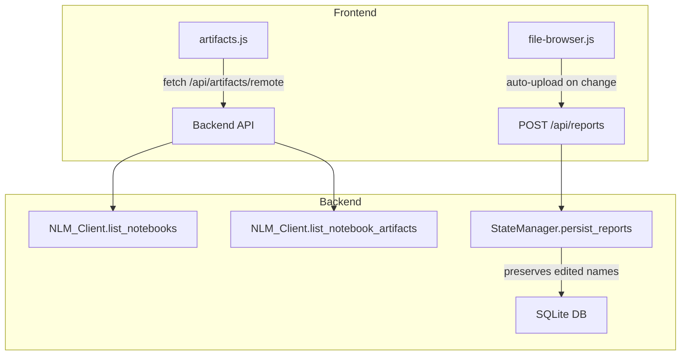
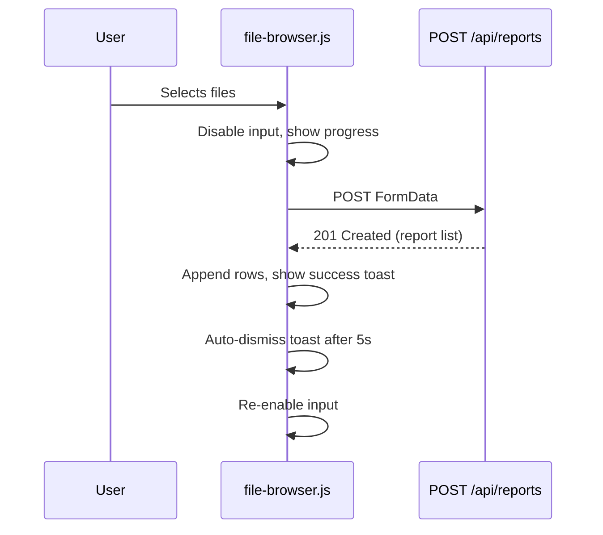

# Design Document: UX Improvements

## Overview

This design addresses three UX issues in the NotebookLM Dashboard:

1. The Artifacts page will be extended to fetch and display pre-existing notebooks/artifacts from the user's NotebookLM account via the NLM SDK, merging them with locally tracked artifacts.
2. The File Browser upload flow will be streamlined by auto-uploading on file selection, removing the explicit Upload button, and adding progress/success/error feedback.
3. The File Browser will preserve user-customized notebook names when new files are uploaded by appending new reports to the DOM rather than re-rendering the entire list.

All changes stay within the existing FastAPI + vanilla JS architecture. No new frameworks or dependencies are introduced.

## Architecture

The changes span three layers:



### Change Summary

| Layer | File | Change |
|-------|------|--------|
| Backend | `app/nlm_client.py` | Add `list_notebook_artifacts()` method |
| Backend | `app/routes/artifacts.py` | Add `/api/artifacts/remote` endpoint that fetches remote notebooks + artifacts |
| Backend | `app/routes/reports.py` | No changes needed (already appends correctly) |
| Backend | `app/state_manager.py` | Ensure `persist_reports` uses INSERT OR IGNORE for existing edited names |
| Frontend | `static/js/artifacts.js` | Fetch remote artifacts, merge with local, render unified list |
| Frontend | `static/js/file-browser.js` | Auto-upload on file select, add progress/success feedback, append-only rendering |
| Template | `app/templates/file_browser.html` | Remove Upload button, add feedback container |
| Template | `app/templates/artifacts.html` | Add error banner area for remote fetch failures |

## Components and Interfaces

### 1. Remote Artifacts API Endpoint

New endpoint: `GET /api/artifacts/remote`

Calls `NLM_Client.list_notebooks()` to get all remote notebooks, then for each notebook calls a new `list_notebook_artifacts()` method to retrieve artifacts. Returns a flat list of remote artifact dicts.

```python
# Response shape
[
    {
        "id": "remote-<notebook_id>-<artifact_index>",
        "artifact_name": "...",
        "artifact_type": "infographic" | "audio" | "video",
        "source_notebook_title": "...",
        "source_notebook_id": "...",
        "created_at": "...",
        "is_remote": True
    }
]
```

The frontend merges these with local artifacts. Deduplication uses a match on `source_notebook_id` + `artifact_name` between remote and local records.

### 2. NLM Client Extension

Add `list_notebook_artifacts(notebook_id: str) -> list[dict]` to `NotebookLMClientWrapper`. This wraps the SDK's method for listing artifacts within a specific notebook.

```python
async def list_notebook_artifacts(self, notebook_id: str) -> list[dict]:
    """List all artifacts in a specific notebook."""
    client = self._ensure_client()
    artifacts = await client.list_artifacts(notebook_id=notebook_id)
    return [
        {
            "id": getattr(a, "id", str(a)),
            "name": getattr(a, "name", ""),
            "type": getattr(a, "type", "unknown"),
            "created_at": getattr(a, "created_at", None),
        }
        for a in artifacts
    ]
```

### 3. File Browser Auto-Upload Flow

The file input `change` event triggers upload immediately. The flow:

1. User selects files → `change` fires
2. JS disables file input, shows progress indicator
3. `POST /api/reports` with FormData
4. On success: show confirmation toast with filenames, append new rows to table, re-enable input
5. On failure: show error message, re-enable input
6. Toast auto-dismisses after 5 seconds



### 4. Notebook Name Preservation

The current `persist_reports` uses `INSERT OR REPLACE`, which overwrites existing rows including edited notebook names. The fix:

- Change `persist_reports` to use `INSERT OR IGNORE` for the initial insert
- For reports that already exist, only update non-name fields (filepath, file_size, last_modified) if `notebook_name_edited` is TRUE
- The frontend `render()` function will be changed to an append-only `appendReports(newReports)` function that adds new rows without clearing existing ones

The `notebook_name_edited` flag already exists in the schema and is set to TRUE by `update_report_notebook_name()`. The JS already debounces name edits and PATCHes them to the backend. The key change is ensuring the frontend doesn't re-render the full list on upload.

## Data Models

### Existing Models (No Changes)

The existing `ReportModel`, `ArtifactModel`, and database schema remain unchanged. The `notebook_name_edited` boolean flag already exists in both the model and the SQLite schema.

### New Response Model: RemoteArtifact

```python
class RemoteArtifactResponse(BaseModel):
    id: str                      # "remote-{notebook_id}-{index}"
    artifact_name: str
    artifact_type: str
    source_notebook_title: str
    source_notebook_id: str
    created_at: Optional[str]
    is_remote: bool = True       # Always True for remote artifacts
```

### Merge Logic

When the frontend receives both local and remote artifacts, it builds a merged list:

1. Create a Set of `(source_notebook_id, artifact_name)` from local artifacts (where `source_notebook_id` maps from `generation_cells.notebook_id`)
2. For each remote artifact, skip if the key exists in the local set
3. Concatenate remaining remote artifacts with local artifacts
4. Sort by `created_at` descending


## Correctness Properties

*A property is a characteristic or behavior that should hold true across all valid executions of a system — essentially, a formal statement about what the system should do. Properties serve as the bridge between human-readable specifications and machine-verifiable correctness guarantees.*

### Property 1: Remote artifact response completeness

*For any* remote artifact returned by the `/api/artifacts/remote` endpoint, the response object shall contain non-empty values for `artifact_name`, `artifact_type`, `source_notebook_title`, and `created_at`.

**Validates: Requirements 1.2**

### Property 2: Merge deduplication produces no duplicates

*For any* set of local artifacts and remote artifacts, the merge function shall produce a list where no two entries share the same `(source_notebook_id, artifact_name)` pair, and the total count is less than or equal to the sum of local and remote counts.

**Validates: Requirements 1.3**

### Property 3: Filters apply consistently across artifact sources

*For any* filter criteria and any mixed list of local and remote artifacts, applying the filter shall return only artifacts matching the criteria, regardless of whether the artifact is local or remote.

**Validates: Requirements 1.5**

### Property 4: Success message contains all uploaded filenames

*For any* set of successfully uploaded filenames, the generated success confirmation message shall contain every filename from the set.

**Validates: Requirements 2.3**

### Property 5: Appending new reports preserves existing reports

*For any* existing report list and any set of new reports, after appending the new reports, every previously existing report shall remain in the list with identical field values (including `notebook_name`).

**Validates: Requirements 3.1, 3.3**

### Property 6: Edited notebook names are protected from overwrite

*For any* report where `notebook_name_edited` is True, calling `persist_reports` with a different `notebook_name` for that report ID shall not change the stored `notebook_name`.

**Validates: Requirements 3.2, 3.5**

### Property 7: Editing a notebook name marks the report as user-edited

*For any* report, after calling `update_report_notebook_name` with a new name, the report's `notebook_name_edited` flag shall be True.

**Validates: Requirements 3.4**

## Error Handling

| Scenario | Behavior |
|----------|----------|
| NLM API unreachable during remote artifact fetch | Return local artifacts only; include `error` field in response for frontend to display banner |
| NLM API returns partial data (some notebooks fail) | Include successfully fetched artifacts; log failures; include warning in response |
| File upload network failure | Show error message with retry guidance; re-enable file input |
| File validation failure (wrong format) | Show error identifying invalid files; upload valid files from the batch |
| File too large (>50MB) | Return 413 with filename; frontend shows specific error |
| Duplicate file upload | Backend uses `INSERT OR IGNORE` for reports with edited names; new uploads for same filename create new report IDs |
| Artifact deletion fails (remote API error) | Show error message, leave artifact in list unchanged |
| Notebook deletion fails (remote API error) | Show error message, leave notebook in list unchanged |
| Test cleanup fails to delete notebook | Log warning with notebook ID for manual cleanup, do not fail the test |
| Duplicate notebook detected | Show warning with option to reuse existing or create new |
| Duplicate prompt detected | Show warning with option to skip, regenerate, or view existing artifact |

## New Components

### 5. Artifact Deletion

New endpoint: `DELETE /api/artifacts/{artifact_id}`

For local artifacts:
- Remove the artifact record from the database
- Delete the artifact file from disk
- Return 200 on success

For remote artifacts (id starts with `remote-`):
- Extract notebook_id from the artifact id
- Call `NLM_Client.delete_artifact(notebook_id, artifact_id)` via new SDK wrapper method
- Return 200 on success

Frontend: Add a delete button to each artifact row. On click, show confirmation dialog. On confirm, call DELETE endpoint. On success, remove the row from the DOM.

### 6. Notebook Deletion

New endpoint: `DELETE /api/notebooks/{notebook_id}`

- Call `NLM_Client.delete_notebook(notebook_id)` via new SDK wrapper method
- Remove all local generation cells and artifacts associated with that notebook_id
- Return 200 on success

Frontend: Add a delete button to notebook entries in the artifacts page. Confirmation required.

### 7. Content Hash for Duplicate Detection

When a report file is uploaded:
1. Compute SHA-256 hash of the file content
2. Store the hash in the `reports` table (new `content_hash` column)
3. Include a short hash suffix (first 8 chars) in the notebook name: `"{name} [{hash8}]"`

When creating a notebook:
1. Check if any existing generation cell has a notebook_id linked to a report with the same content_hash
2. If found, warn the user before proceeding

When listing remote notebooks:
1. Parse notebook names for hash suffixes
2. Match against local report content_hashes
3. Flag matched notebooks as "already linked"

### 8. Prompt Hash for Duplicate Prompt Detection

When a generation is requested:
1. Compute SHA-256 hash of the template prompt content
2. Store the hash in the `generation_cells` table (new `prompt_hash` column)
3. Before submitting, check if a completed cell exists with the same (report_id, prompt_hash)
4. If found, warn the user with options: skip, regenerate, or view existing

When a template's content is edited:
1. The prompt_hash is recomputed on next generation request
2. Edited prompts are treated as new (different hash)

### 9. Test Cleanup Fixture

A pytest fixture that:
1. Tracks all notebook IDs created during a test via a list
2. In teardown, calls `NLM_Client.delete_notebook(id)` for each
3. Logs warnings for any cleanup failures (does not fail the test)

```python
@pytest_asyncio.fixture
async def nlm_cleanup(nlm_client):
    created_notebooks = []
    yield created_notebooks
    for nb_id in created_notebooks:
        try:
            await nlm_client.delete_notebook(nb_id)
        except Exception as e:
            logger.warning("Test cleanup failed for notebook %s: %s", nb_id, e)
```

## Correctness Properties (New)

## Correctness Properties (New)

### Property 8: Artifact deletion removes record and file

*For any* local artifact, after successful deletion via the DELETE endpoint, the artifact record shall not exist in the database and the artifact file shall not exist on disk.

**Validates: Requirements 4.2**

### Property 9: Notebook deletion cascades to local records

*For any* notebook deletion, all generation cells and artifacts associated with that notebook_id shall be removed from the local database.

**Validates: Requirements 5.3**

### Property 10: Content hash is deterministic

*For any* file content, computing the SHA-256 hash twice shall produce the same result. Two files with identical content shall produce the same hash. Two files with different content shall produce different hashes.

**Validates: Requirements 7.1**

### Property 11: Duplicate notebook detection is accurate

*For any* report with a stored content_hash, if a notebook exists whose name contains the same hash suffix, the system shall flag it as "already linked".

**Validates: Requirements 7.2, 7.5**

### Property 12: Prompt hash changes when content changes

*For any* template, editing the prompt content shall produce a different prompt_hash than the original content.

**Validates: Requirements 8.4**

## Testing Strategy

### Property-Based Testing

Use **Hypothesis** (Python) for backend property tests. Each property test runs a minimum of 100 iterations.

| Property | Test Target | Strategy |
|----------|-------------|----------|
| Property 1 | `list_notebook_artifacts` response | Generate random notebook/artifact data, verify all required fields present |
| Property 2 | Merge function | Generate random local + remote artifact lists with overlapping keys, verify no duplicates |
| Property 3 | Filter function | Generate mixed artifact lists + random filter criteria, verify consistent filtering |
| Property 4 | Success message builder | Generate random filename sets, verify all appear in message |
| Property 5 | `persist_reports` + list | Generate existing reports + new reports, verify existing unchanged |
| Property 6 | `persist_reports` with edited names | Generate reports with `notebook_name_edited=True`, attempt overwrite, verify name preserved |
| Property 7 | `update_report_notebook_name` | Generate random report + name, verify flag set |

Each test is tagged with: **Feature: ux-improvements, Property {N}: {title}**

### Unit Testing

Unit tests complement property tests for specific examples and edge cases:

- Remote fetch returns empty notebook list → artifacts page shows only local
- Remote fetch timeout → error banner displayed, local artifacts shown
- Upload of 0 files → no change to report list
- Upload of mix of valid/invalid files → valid uploaded, error for invalid
- Notebook name edit followed by new upload → edited name preserved (concrete example)
- Merge with zero overlap → all artifacts included
- Merge with complete overlap → only local artifacts remain

### Test Organization

- Property tests: `tests/property/test_ux_improvements.py`
- Unit tests: `tests/unit/test_ux_improvements.py`
- Frontend behavior tested via backend API tests (no separate JS test framework assumed)
